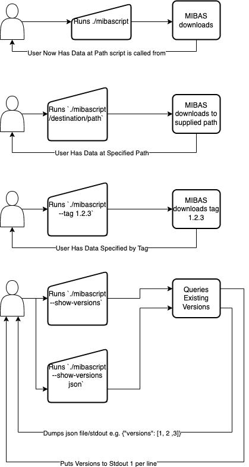

# MIBASFetcher
Small Script/Tool That Gets MIBAS (And maybe versions of MIBAS)

We need to be realistic about how well this will work/how much maintenance it will require on our end. In theory we can run CI on this and it will just work, but in reality that's rarely the case. 

Discuss here and in issues. 

## Design Requirements

0) Easy Installation and Execution
  - download `mibasfetcher`
  - run `./mibasfetcher`
  - Python based?
1) Fetch MIBAS from Places
  - OpenNeuro
  - Random Urls
  - GitAnnex Dataset 
  - Datalad Dataset
2) Runs on
  - Everywhere, Mac, Linux, Windows
  
## Where are we storing this data?

Openneuro? FTP?

## Flow Diagram e.g.

If it get's more complicated then this I think we should stop.

## Create a First Draft w/ Datalad
  make a datalad folder, and make datalad work for current MIBAS
 
